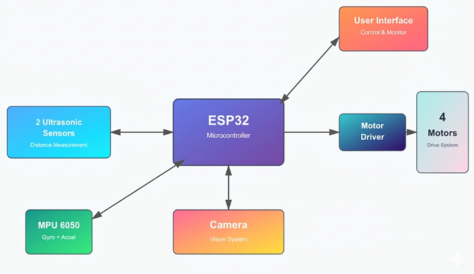

# 🚗 Drive Tutor

> A web-controlled RC car with real-time FPV streaming, physics-based dashboard simulation, AI driving instructor, and autonomous emergency braking — built with ESP8266, ESP32-CAM, and Gemini API.

---

## ✨ Features

- **🎮 Browser-Based Control** — Drive the RC car from any device using a fully interactive web interface with steering wheel, pedals, and gear system
- **📹 FPV Live Stream** — Real-time First-Person View video feed via ESP32-CAM embedded directly in the dashboard
- **🧠 AI Driving Instructor** — Powered by Gemini API; monitors telemetry and gives corrective driving feedback in plain English
- **⚡ Autonomous Emergency Braking (AEB)** — Ultrasonic sensors detect obstacles and override throttle to prevent collisions automatically
- **📊 Physics Simulation** — Realistic RPM, speed, gear, and fuel simulation running entirely in JavaScript
- **📱 Cross-Platform** — Works on both mobile (touch) and desktop (mouse + keyboard)

---

## 🏗️ System Architecture



### How It Works

```
Browser Interface (HTML/CSS/JS)
        │
        │  HTTP requests (motor commands, sensor polling)
        ▼
   ESP8266 (NodeMCU)          ESP32-CAM
   - Motor control            - FPV video stream
   - AEB logic                - Serves MJPEG feed
   - Sensor polling           - Independent WiFi server
        │
   L293D Motor Driver
        │
   2× DC Motors
        │
   2× HC-SR04 Ultrasonic Sensors (front + rear)
```

---

## 🔧 Hardware Components

| # | Component | Purpose |
|---|---|---|
| 1 | NodeMCU ESP8266 | Main controller — motor logic, HTTP server, AEB |
| 2 | ESP32-CAM | FPV video streaming |
| 3 | HC-SR04 × 2 | Front and rear obstacle detection |
| 4 | L293D IC | H-bridge motor driver |
| 5 | DC Motor × 2 | Drive wheels |
| 6 | Buck Converter | Steps down battery voltage to regulated 5V |
| 7 | Li-Ion Battery × 3 | 2000mAh each — powers full system |
| 8 | RC Car Chassis | 2 drive wheels + 1 ball caster |

---

## 💻 Software Stack

| Layer | Technology |
|---|---|
| Firmware | Arduino IDE, C++ |
| Frontend | HTML5, CSS3, Vanilla JavaScript |
| AI | Google Gemini API |
| Streaming | ESP32-CAM MJPEG over HTTP |
| Communication | HTTP GET/POST over WiFi |

---

## 🚀 Getting Started

### Prerequisites

- [Arduino IDE](https://www.arduino.cc/en/software) with ESP8266 and ESP32 board packages installed
- A Google Gemini API key — get one free at [aistudio.google.com](https://aistudio.google.com)
- A device on the same WiFi network as the car to access the web interface

### 1. Flash the ESP8266 Firmware

1. Open `firmware/esp8266_main/esp8266_code.ino` in Arduino IDE
2. Update the WiFi credentials in the file:
```cpp
const char* ssid = "YOUR_WIFI_SSID";
const char* password = "YOUR_WIFI_PASSWORD";
```
3. Select board: **NodeMCU 1.0 (ESP-12E Module)**
4. Upload the sketch

### 2. Flash the ESP32-CAM

1. Follow standard ESP32-CAM setup for MJPEG streaming
2. Update WiFi credentials to match ESP8266
3. Note the IP address printed on Serial Monitor after boot

### 3. Set Up the Web Interface

1. Open `web-interface/index.html`
2. Find the API key placeholder and replace it:
```js
const GEMINI_API_KEY = "YOUR_GEMINI_API_KEY_HERE";
```
3. Update the ESP8266 and ESP32-CAM IP addresses in `script.js` to match your network
4. Open `index.html` in any browser on the same WiFi network


## 📁 Project Structure

```
drive-tutor/
├── firmware/
│   └── esp8266_code.ino          # ESP8266 motor control + AEB logic
├── web-interface/
│   ├── index.html                # Main dashboard UI
│   ├── script.js                 # Control logic, physics sim, Gemini API
│   └── style.css                 # Gauges, pedals, steering wheel styles
├── docs/
│   ├── block_diagram.png         # System architecture diagram
│   └── final_report.pdf          # Full project report
├── media/
│   ├── dashboard_screenshot.png  # UI screenshot
│   └── hardware_photo.jpg        # Assembled hardware
├── LICENSE
└── README.md
```

---

## 🧠 Key Concepts Implemented

- **Microcontroller Networking** — Asynchronous HTTP communication across dual microcontrollers
- **Physics Simulation** — Real-time RPM, speed, fuel, and gear behaviour in JavaScript
- **AI API Integration** — Telemetry-driven prompts sent to Gemini for natural language driving feedback
- **Anti-Flood Throttling** — State-change checks prevent ESP8266 server crashes under high input frequency
- **Autonomous Safety Logic** — Software-in-the-loop AEB overrides throttle on proximity detection

---

## 🔮 Future Scope

- Lane detection using ESP32-CAM and OpenCV
- Mobile app replacement for the browser interface
- Multi-car control with independent WiFi channels
- Data logging and trip analytics dashboard
- Voice-controlled driving commands

---

## 📄 License

This project is licensed under the MIT License — see the [LICENSE](LICENSE) file for details.

---

## 👤 Author

**Adithya** — [@addy20-05](https://github.com/addy20-05)

> Built as part of a B.E. final year project. Feel free to fork, star ⭐, or reach out!
